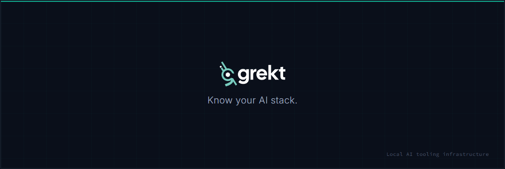

<p align="center">
  
</p>

[](https://securityscorecards.dev/viewer/?uri=github.com/grekt-labs/cli)
[](https://snyk.io/test/github/grekt-labs/cli)
[](https://socket.dev/npm/package/@grekt/cli)

The package manager for AI coding tools. Manage prompts, rules, agents, and skills across Claude Code, Cursor, Windsurf, Copilot, Cline, and [more](https://docs.grekt.com) - version-controlled, shareable, and synced.

> **Free to use.** grekt is free for personal and commercial use. If you're building something with it, we'd love to hear about it. The source is available under [BSL 1.1](./LICENSE), which just means you can't use this code to build something that competes with grekt. Each version converts to [MIT](./LICENSING.md) after two years.

## Why grekt?

AI coding assistants rely on project rules, custom instructions, and agent configurations - but there's no standard way to manage, share, or keep them in sync. grekt solves this:

- **One command** to add community or private artifacts to any project
- **Deterministic installs** via lockfile, just like npm or cargo
- **Auto-sync** to every tool your team uses - no manual copy-paste between `.cursorrules`, `CLAUDE.md`, `.windsurfrules`, etc.
- **Publish and share** artifacts with your team or the [community registry](https://explore.grekt.com)

## Installation

### Linux / macOS

```bash
curl -fsSL https://cli.grekt.com/install.sh | sh
```

### macOS (Homebrew)

```bash
brew install grekt-labs/tap/grekt
```

### npm

```bash
npm install -g @grekt/cli
```

## Quick Start

```bash
grekt init                        # Initialize a project
grekt add @scope/artifact-name    # Add an artifact
grekt install                     # Install from lockfile
grekt sync                        # Sync to your AI tools
```

Artifacts can come from the [public registry](https://explore.grekt.com) (`@scope/name`), GitHub (`github:user/repo`), GitLab (`gitlab:host/user/repo`), or a local path (`./path`).

### Supported tools

grekt syncs to Claude Code, Cursor, Windsurf, Cline, GitHub Copilot, Aider, Continue, OpenCode, Amazon Q, and any tool following the [agentskills.io](https://agentskills.io) standard (Codex, Gemini CLI, Devin, Amp, Zed, and others).

For the full command reference and guides, visit the [documentation](https://docs.grekt.com).

## Development

Requires [Bun](https://bun.sh) >= 1.0.

```bash
bun install
bun link    # makes grekt available globally
bun test
```

## Contributing

See [CONTRIBUTING.md](./CONTRIBUTING.md). Feature requests and bug reports are welcome.

## License

[BSL 1.1](./LICENSE) - [What does this mean?](./LICENSING.md)
